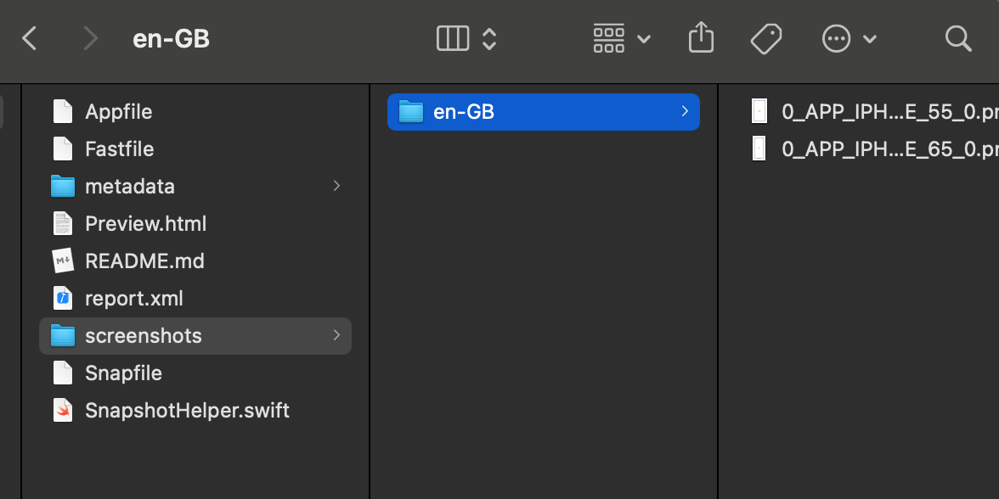

## Fastlane 扩展

可以添加多语言上传到 App Store Connect

根据添加的多语言把描述文件和更新说明可以翻译成对应语言

翻译使用的是 translate Shell  [安装使用说明](https://www.mdeditor.tw/pl/plXm)

必须要先安装 translate Shell 

trans 不能连续调用，不然就会翻译失败，屏蔽的是 ip，大概几个小时后会解封

### 使用说明

项目先 fastlane 初始化

可以运行以下命令来获取应用元数据和截图

```
fastlane deliver download_screenshots
fastlane deliver download_metadata
```

操作 tagfile 文件夹下的文件

1.把 ruby 复制到 项目文件目录 即 xxx.xcodeproj 文件所在目录

2.把 Fastfile , Snapfile 复制到 fastlane 文件目录替换掉之前的

3.在 Snapfile 文件中解注释主语言 在 screenshots 文件夹中创建主语言代码对应的文件夹

如：Snapfile 主语言为 en-GB,那么 在 screenshots 文件夹中 创建 en-GB的文件

然后把5.5，6.5屏幕截图放到 主语言文件夹中 如下图：



4.然后回到 项目所在 打开 ruby 文件

5.解注释 languages 中 你想添加的多语言 保存退出

6.打开命令行，cd 到ruby 文件所在目录 运行

```
chmod 777 ruby
./ruby
```

等待翻译上传，有问题，看输入提示自行解决。